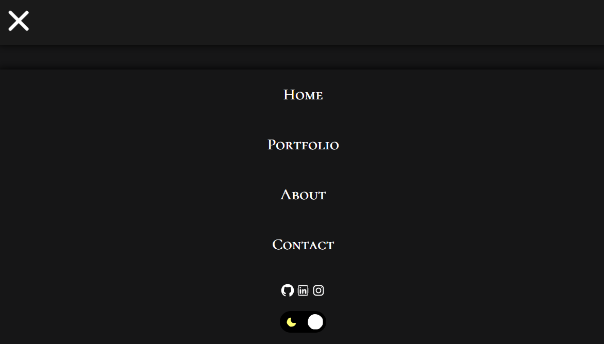

<h1>Portfolio Website</h1>

  
  

<picture></picture>

## Description
> Source code for my portfolio website

## Reason For Making
> I wanted to build a portfolio project that would allow me to exercise creativity while simultaneously serve as a professional hub for potential employers.

## Author
👤 **Chiahao Chou**

## Built With
* HTML5
* CSS3
* Javascript

## Features
There is a mode switch to alternate between light and dark mode.
<picture></picture>

<picture></picture>

The mobile version has a drop-down menu.
<picture></picture>

## Social Media
* Github: (https://github.com/chiahao-codes)
* IG: (https://instagram.com/chiahaocodes)
* LinkedIn: (https://www.linkedin.com/in/chiahaocodes/)

## Show your support
Give a ⭐️ if this project helped you!

***
_This README was generated with ❤️ by [readme-md-generator](https://github.com/kefranabg/readme-md-generator)_